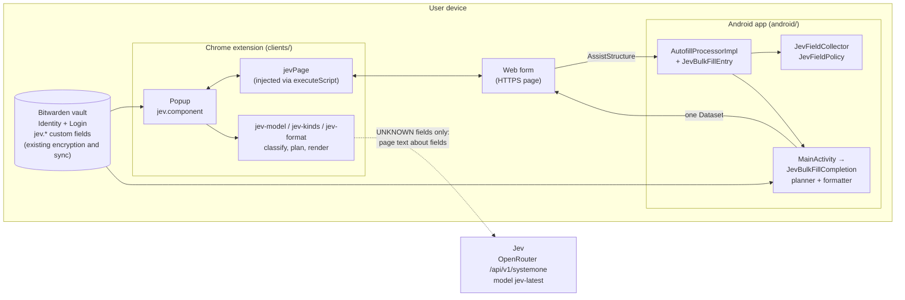
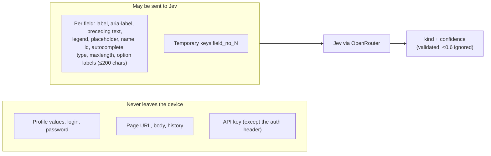
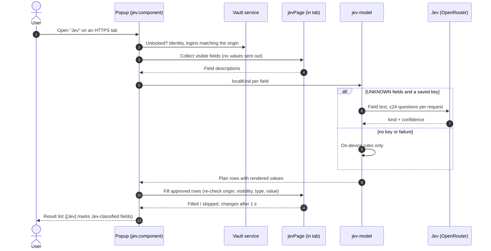
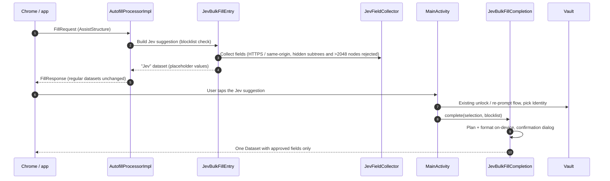

# Architecture

How jev-autofill fits into Bitwarden and where the trust boundaries are. Rules behind these choices: [AGENTS.md](../AGENTS.md#jev-request-boundary-product-requirement).

## Overview

- Both clients share the same design: **on-device rules first**, Jev only for fields the rules leave UNKNOWN, and **every value is rendered on the device**. Jev returns a field kind, never a value.
- Profile data stays in the existing Bitwarden vault (Identity plus encrypted `jev.*` custom fields). There is no separate store, encryption or sync.
- Today only the Chrome extension queries Jev; Android uses on-device rules only (porting the request format is an open issue).

## Trust boundary

Before any value is written: vault unlocked, HTTPS origin matches, fields re-validated, hidden fields and cross-origin iframes skipped, existing values kept, no auto-submit, no OTP, blocklist applied.

## Chrome extension flow

Code: `clients/apps/browser/src/autofill/jev/` (`jev-page.ts`, `jev-model.ts`, `jev-kinds.ts`, `jev-format.ts`) and `clients/apps/browser/src/autofill/popup/jev/`.

## Android flow

Code: `android/app/src/main/kotlin/com/x8bit/bitwarden/data/autofill/jev/`. Existing classes changed only through defaulted parameters: `AutofillSelectionData`, `AutofillIntentUtils`, `FillResponseBuilder(Impl)`, `AutofillProcessorImpl`, `MainActivity`, `InlinePresentationSpecExtensions`.

## Shared classification model

- A field kind is a bit mask of profile parts (name, kana, postal, address parts region → building, phone parts, birth date parts, gender, company, …). Combined fields are unions, e.g. `ADDRESS_FULL`.
- `refine` removes parts that other fields in the same form already cover and splits consecutive same-label fields (postal 3+4, phone ×3, …).
- Formatting (hyphens, width, kana type, era dates) comes from the field's label, placeholder and maxlength.
- Origin of the rules: `probe/src/dev/ryu/jevprobe/Policy.java` and `Profile.java`, ported to Kotlin (`JevFieldPolicy`, `JevFormatter`) and TypeScript (`jev-kinds.ts`, `jev-format.ts`).

## Verification layers

| Layer | Where | Runs in CI |
| --- | --- | --- |
| Policy rules (JVM, 164 assertions) | `probe/test/` | yes (`.github/workflows/probe.yml`) |
| Probe Python tools (key handling, transport) | `probe/test_*.py` | yes |
| Android unit tests, detekt | `android/` | no (separate working copy) |
| Chrome Jest, ESLint, tsc | `clients/` | no (separate working copy) |
| Device E2E on synthetic pages | `probe/smoke.py`, `probe/fixture/patterns/` | no (emulator) |
| Real-form evaluation | `probe/corpus/` (data kept local) | no |
